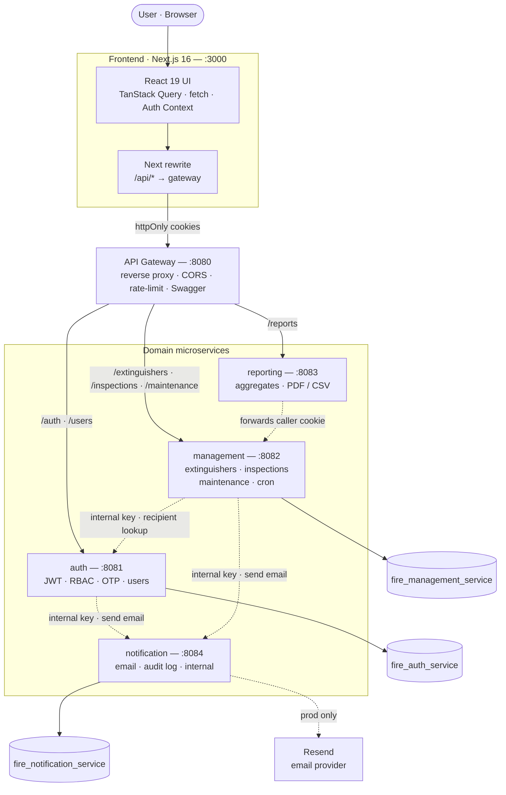
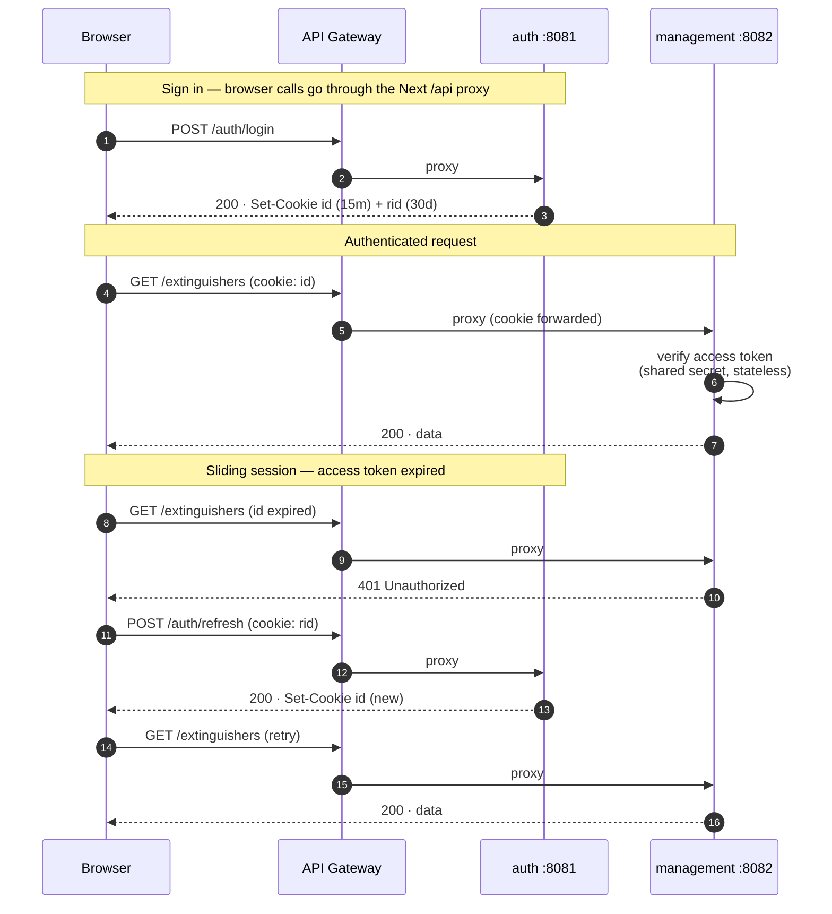
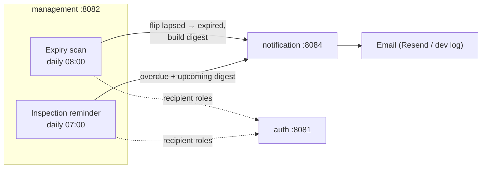

# System Architecture

A RESTful **microservices** backend for TZW LTD's Fire Extinguisher Management
System, fronted by a **Next.js** web client. A single **API Gateway** is the only
public entry point; it reverse-proxies to four domain services. Each service is
independently deployable, owns its own database (**database-per-service**), and
authenticates every request by **statelessly verifying a shared JWT** — so no
service depends on another at request time except for a few deliberate,
internal-key-authenticated calls.

| Component            | Port | Stateful?                   | Responsibility                                                                 |
| -------------------- | ---- | --------------------------- | ------------------------------------------------------------------------------ |
| **Frontend (Next.js)** | 3000 | —                         | Web UI; rewrites `/api/*` to the gateway (same-origin, no CORS)                 |
| **API Gateway**      | 8080 | —                           | Single public entry point; reverse proxy, CORS, rate-limit, aggregated Swagger |
| **auth**             | 8081 | `fire_auth_service`         | Registration, login, JWT sessions, RBAC, OTP verification, password reset, users |
| **management**       | 8082 | `fire_management_service`   | Extinguisher registry, inspections, maintenance; **cron jobs**                 |
| **reporting**        | 8083 | — (aggregates over HTTP)    | Inventory / inspection / compliance / maintenance reports + PDF/CSV export      |
| **notification**     | 8084 | `fire_notification_service` | Centralized outbound email + delivery audit log (**internal-only**)            |
| `@repo/core`         | —    | —                           | Shared logging, errors, JWT auth middleware, HTTP client, bootstrap, validation |

> The diagrams below render on GitHub, GitLab, Notion, Obsidian, VS Code (with a
> Mermaid extension), and at <https://mermaid.live>. Copy a code block to reuse it.

## Component diagram

**Solid lines** are the synchronous request path (browser → gateway → service →
database). **Dashed lines** are internal, service-to-service calls guarded by a
shared `INTERNAL_API_KEY` (or, for reporting, the caller's forwarded cookie).

## Request & authentication flow

The auth service signs a short-lived **access token** (15 min) and a long-lived
**refresh token** (30 days) into `httpOnly` cookies (`id` and `rid`). Every other
service verifies the access token with the shared `ACCESS_TOKEN_SECRET` — no DB
lookup, no call to auth. Only the auth service can **refresh** (it owns the user
table), and the frontend's fetch client transparently refreshes on a `401`
(sliding sessions).

> The browser only ever talks to the same-origin Next app, which rewrites
> `/api/*` to the gateway. This avoids CORS entirely and keeps the auth cookies
> host-scoped, so `SameSite=Lax` works without extra configuration.

## Role-based access control (RBAC)

Three roles, verified statelessly from the JWT on every service:

| Role        | Capabilities                                                                 |
| ----------- | ---------------------------------------------------------------------------- |
| `user`      | View status/history; schedule inspections                                    |
| `inspector` | + register/update extinguishers, complete inspections, log maintenance       |
| `admin`     | + delete records, manage users and roles, full access                        |

The frontend hides actions a role can't perform, but the server is the source of
truth — every service re-checks the role and rejects unauthorized calls.

## Scheduled jobs (management service)

Two idempotent background jobs run via `node-cron` (toggle with `CRON_ENABLED`):

Recipients are resolved from auth's internal directory API
(`ALERT_RECIPIENT_ROLES`, default `admin,inspector`). Both jobs can also be
triggered on demand via internal `POST /jobs/*` endpoints.

## Key design decisions

- **Database-per-service** — no cross-service foreign keys; cross-service
  references (e.g. `inspection.inspectorId`) store a user `id` carried in the JWT.
- **Stateless JWT auth** — services verify the access token locally; refresh is
  owned solely by auth.
- **Centralized notifications** — all outbound email flows through the
  notification service and is recorded in an audit log; in dev (no
  `RESEND_API_KEY`) emails are logged, not sent.
- **Reporting is a pure aggregator** — no database; it forwards the caller's
  cookie to management so the same authentication/RBAC applies.
- **Same-origin frontend** — the browser talks only to the Next app, which
  proxies `/api/*` to the gateway.

## See also

- [`db-schema.md`](./db-schema.md) — the per-service data model (ER diagram).
- [`../README.md`](../README.md) — setup, environment reference, and API overview.
