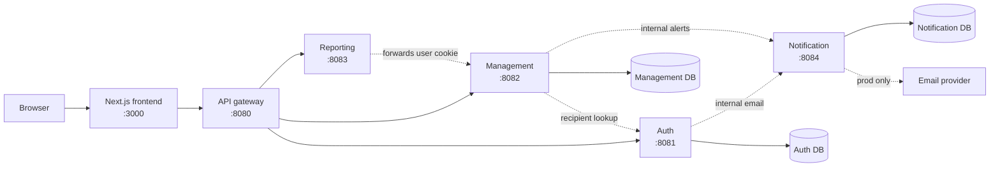
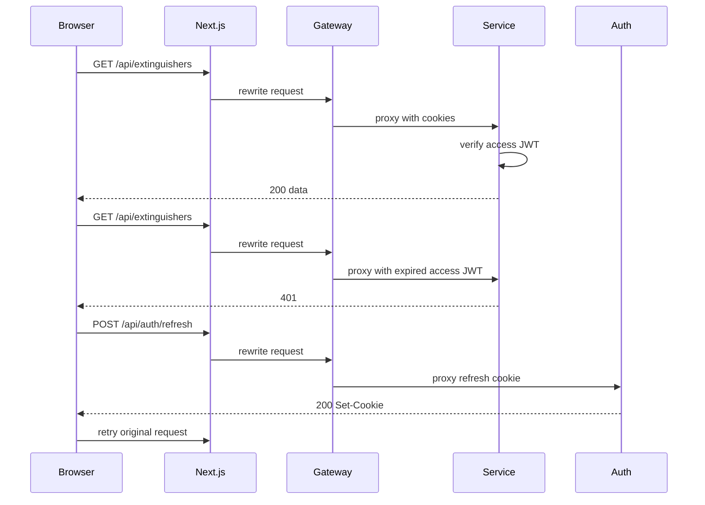

# System Architecture

TZW Fire Safety is a Next.js frontend backed by REST microservices. The browser
uses same-origin `/api/*` requests, the frontend rewrites those requests to the
API gateway, and the gateway routes to domain services.

## Overview

Solid lines are public request paths. Dashed lines are internal service calls.
Internal service calls use `INTERNAL_API_KEY`, except reporting, which forwards
the caller's cookie to management so normal auth and RBAC still apply.

## Components

| Component | Role | State |
| --- | --- | --- |
| Frontend | React UI, auth state, `/api/*` rewrite to gateway | Stateless |
| Gateway | Public API edge, reverse proxy, CORS/rate limits, Swagger index | Stateless |
| Auth | Users, login, JWT cookies, refresh, RBAC, OTP/password reset | Auth DB |
| Management | Extinguishers, inspections, maintenance, scheduled jobs | Management DB |
| Reporting | Report aggregation and PDF/CSV export | Stateless |
| Notification | Email delivery and notification audit log | Notification DB |
| `@repo/core` | Shared middleware, errors, logging, HTTP helpers, validation | Library |

## Request Flow

## Rules

- The gateway is the only public backend entry point.
- Services own their own data; there are no cross-service foreign keys.
- Services verify access tokens locally with the shared `ACCESS_TOKEN_SECRET`.
- Only auth refreshes sessions because it owns users and refresh-token state.
- Reporting does not own a database; it reads through management.
- Notification is internal-only; other services do not send email directly.
- Scheduled alert jobs live in management and call auth/notification internally.

## Related Docs

- [Database schema](./db-schema.md)
- [Project setup and API reference](../README.md)
