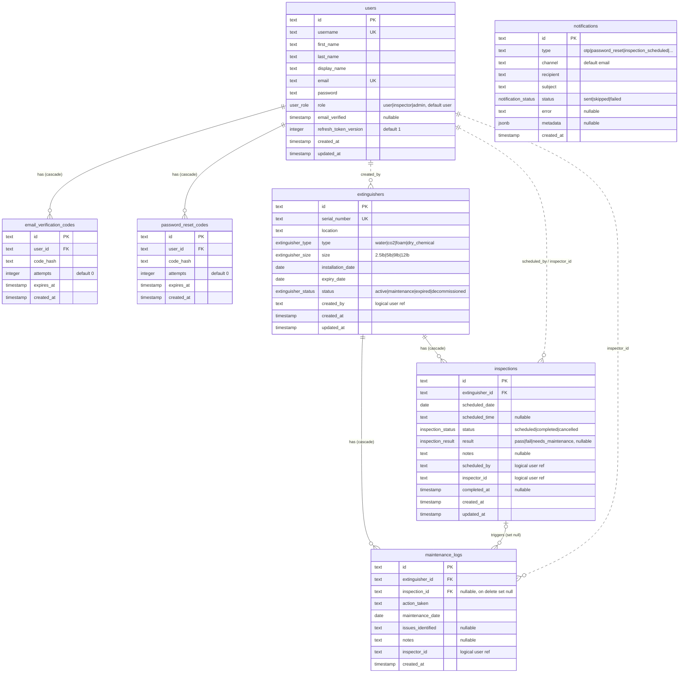

# Database Schema

The application follows a **microservices** architecture with **three independent
PostgreSQL databases** — one per service. There are **no foreign keys across service
boundaries**: fields like `created_by`, `scheduled_by`, and `inspector_id` hold a user
`id` issued by the auth service (via JWT), but they are deliberately *not* enforced at
the database level because users live in a different service's database.

| Service        | Database                   | Tables                                                       |
| -------------- | -------------------------- | ------------------------------------------------------------ |
| Auth           | `fire_auth_service`        | `users`, `email_verification_codes`, `password_reset_codes`  |
| Management     | `fire_management_service`  | `extinguishers`, `inspections`, `maintenance_logs`           |
| Notification   | `fire_notification_service`| `notifications`                                              |

> The diagram below renders on GitHub, GitLab, Notion, Obsidian, VS Code (with a Mermaid
> extension), and at <https://mermaid.live>. Copy the code block to reuse it elsewhere.
> For dbdiagram.io, use the DBML source in [`db-schema.dbml`](./db-schema.dbml).

## ER Diagram

## Legend

- **Solid lines (`--`)** — real foreign keys enforced inside a single service's database
  (the `onDelete` behavior is noted on each relationship).
- **Dashed lines (`..`)** — *logical* references that cross a service boundary. These are
  not real foreign keys; they store a user `id` from the auth service.
- `inspections |o--o{ maintenance_logs` — `maintenance_logs.inspection_id` is nullable, so
  a maintenance log may exist without an inspection; deleting an inspection sets it `null`.
- Enum domains are listed inline in each column's comment.
